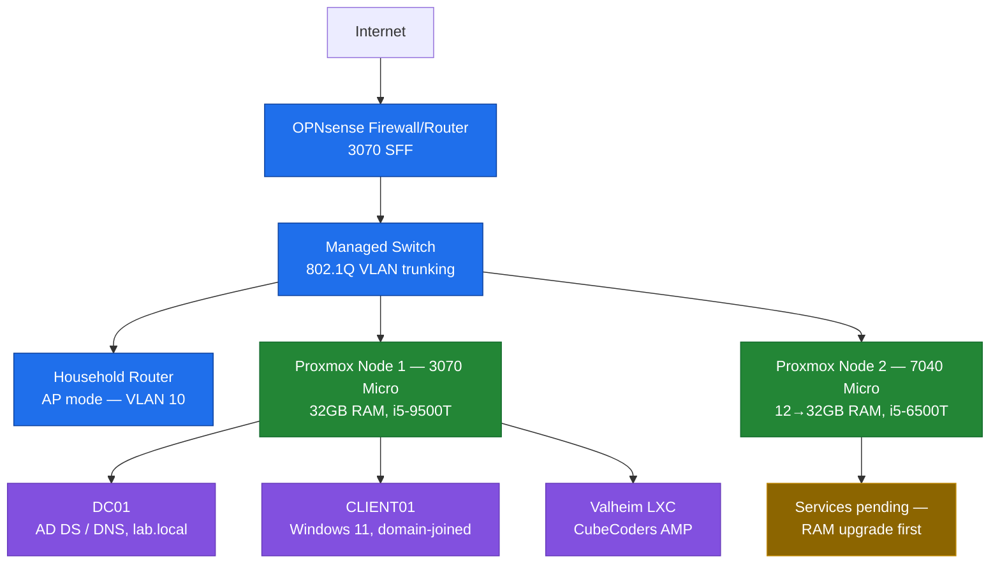

# Home Lab

I built and operate this three-node home lab to develop practical, hands-on experience in virtualization, Active Directory administration, network segmentation, and service operations.

**Status:** active, in progress. The virtualization platform, AD lab, and a live game server are all running; network segmentation is designed but not yet cut over — see [Roadmap](#roadmap).

## Architecture at a glance

This is the target topology — the OPNsense/VLAN cutover hasn't happened yet, so today everything still runs on the flat household network. Full explanation: [network-segmentation.md](docs/network-segmentation.md).

## What I built

- A 2-node Proxmox VE cluster with a documented, deliberate quorum/HA tradeoff (no QDevice, manual placement) rather than an unexamined default
- An Active Directory lab: a Windows Server 2022 domain controller and a domain-joined Windows 11 client, hitting and fixing a real DNS/IPv6 resolution bug along the way
- A production-managed Valheim dedicated game server (CubeCoders AMP), open to real external players, migrated from a manual build without losing world data
- A capacity plan revised after benchmarking actual hardware (CPU, not RAM, turned out to be the real constraint on the older node)
- A planned VLAN-segmented network behind an OPNsense firewall, scoped around real physical constraints (existing cable runs, AP placement, available NIC slots)

## Technical focus

| Area | Skills demonstrated |
|---|---|
| Virtualization | Proxmox VE clustering, quorum/HA tradeoffs, LXC vs. VM placement decisions, capacity planning against real CPU/RAM constraints |
| Systems administration | Windows Server 2022 AD DS/DNS, domain join, VirtIO drivers, UEFI/TPM guest requirements, SSH key-only hardening |
| Networking | VLAN segmentation design, 802.1Q trunking, DNS resolution troubleshooting, IPv6/IPv4 interaction issues |
| Operations | Service migration without data loss, backup job configuration, third-party script trust evaluation before running as root |
| Troubleshooting | Diagnosing from live process state and vendor source/config rather than assumptions, recognizing recurring failure patterns across systems |

## Portfolio guide

### Design and operations

| Document | What it demonstrates |
|---|---|
| [Architecture overview](docs/architecture-overview.md) | End-to-end design and priorities behind the lab |
| [Virtualization platform](docs/virtualization-platform.md) | Proxmox cluster design, quorum tradeoff, CPU-based capacity replanning |
| [Active Directory lab](docs/active-directory-lab.md) | DC/client build, AD DS/DNS roles, domain join troubleshooting |
| [Service platform](docs/service-platform.md) | Valheim/AMP build, script trust evaluation, stateful migration |
| [Network segmentation](docs/network-segmentation.md) | VLAN/OPNsense design and what's actually blocking the cutover |
| [Backup and recovery](docs/backup-and-recovery.md) | What's backed up, what's not yet restore-validated, and why that distinction matters |

### Case studies

| Case study | What it demonstrates |
|---|---|
| [Proxmox cluster IPv6 masking](case-studies/proxmox-cluster-ipv6-masking.md) | Diagnosing a cluster-join failure down to an IPv6/IPv4 config root cause |
| [AD domain-join IPv6 masking](case-studies/ad-domain-join-ipv6-masking.md) | Recognizing a recurring failure pattern across two different systems |
| [AMP AuthServerURL bug](case-studies/amp-authserver-url-bug.md) | Tracing a broken management UI to a bad default config value |
| [Valheim portal-modifier flag bug](case-studies/valheim-portal-modifier-flag.md) | Verifying a dashboard setting against the live process instead of trusting the UI |
| [Server Devcommands dual-permissions bug](case-studies/server-devcommands-dual-permissions.md) | Diagnosing two permission systems that needed to agree |

## Technology used

Proxmox VE · Windows Server 2022 (AD DS, DNS) · Windows 11 · OPNsense (planned) · CubeCoders AMP · SteamCMD · systemd · Debian LXC · VirtIO · Git/GitHub

## Roadmap

- [ ] Complete OPNsense/VLAN network cutover
- [ ] RAM upgrade (7040 Micro, 12GB → 32GB) and SSD storage installs across all three nodes
- [ ] PowerShell AD automation — scripted user provisioning (CSV → AD user/group/OU, with error handling and logging)
- [ ] Backup restore validation — actually restore a VM from the existing nightly backup and document the process
- [ ] Lightweight SIEM (Wazuh) — centralize and monitor AD/service logs for authentication anomalies
