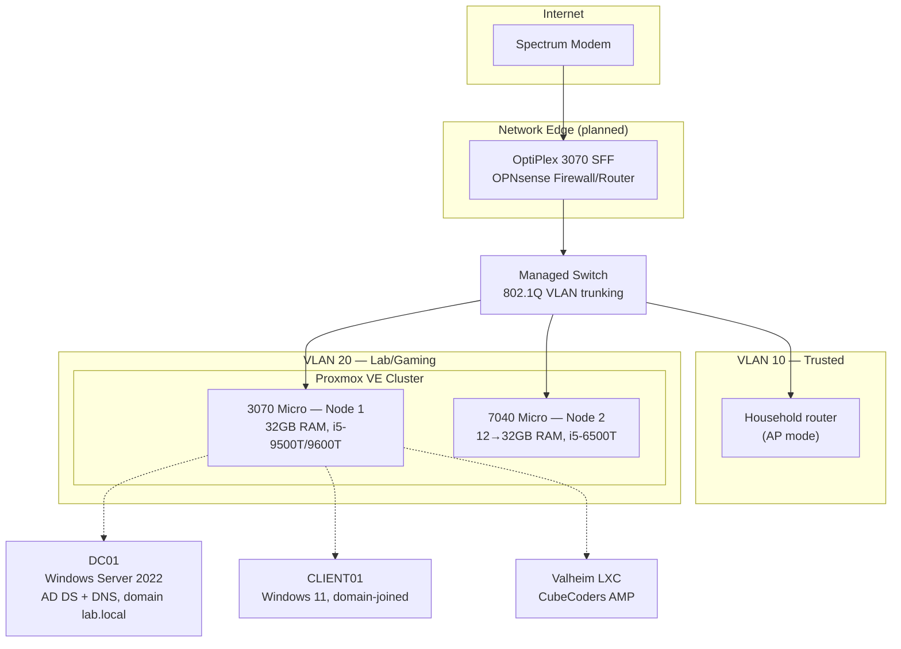

# Home Lab

A three-node virtualization and networking lab built from repurposed enterprise desktops, used to develop and demonstrate hands-on sysadmin, virtualization, and networking skills.

**Status:** active / in progress — see [Roadmap](#roadmap).

## Overview

- Started August 2026 on three Dell OptiPlex business desktops (SFF, Micro, Micro).
- Running today:
  - A 2-node Proxmox VE cluster
  - An Active Directory lab (Windows Server 2022 domain controller + domain-joined Windows 11 client)
  - A production-managed Valheim dedicated game server (CubeCoders AMP), serving real external players
- In progress: segmenting the lab onto its own VLAN behind an OPNsense firewall, moved off the flat household network.

## Architecture

**Current state note:** the diagram above is the target topology. The OPNsense/VLAN cutover hasn't happened yet — today everything still runs on the flat household network (`vmbr0`) while cabling and a second NIC for the edge box are sourced. The Proxmox cluster, AD lab, and Valheim server are all live now regardless of the network cutover status.

## Hardware

| Role | Hardware | RAM | CPU |
|---|---|---|---|
| Network edge (planned OPNsense) | OptiPlex 3070 SFF | — | i5-9500T or 9600T (6C/6T) |
| Proxmox node 1 | OptiPlex 3070 Micro | 32GB | i5-9500T or 9600T (6C/6T) |
| Proxmox node 2 | OptiPlex 7040 Micro | 12GB → 32GB (upgrade pending) | i5-6500T (4C/4T) |

## Services

| Service | Host | Purpose | Status |
|---|---|---|---|
| Proxmox VE cluster | 3070 Micro + 7040 Micro | Virtualization platform, 2-node, manual failover (no HA) | Live |
| DC01 — AD DS / DNS | 3070 Micro | Domain controller for `lab.local`, GPO/login testing | Live |
| CLIENT01 | 3070 Micro | Domain-joined Windows 11 client for AD testing | Live |
| Valheim (AMP) | 3070 Micro | Dedicated game server, modded, open to external players | Live |
| OPNsense firewall/router | 3070 SFF | Network edge, VLAN segmentation | Planned |

## Key Engineering Decisions

- **Skipped HA, kept quorum simple.** A 2-node cluster only has 2 corosync votes, so losing either node freezes cluster-wide management (though running VMs stay up locally). Chose to manage placement manually rather than add a QDevice tie-breaker, since it's a solo lab — documented the tradeoff rather than ignoring it.
- **Found the real bottleneck was CPU, not RAM.** The older node (7040 Micro) looked RAM-constrained at first, but benchmarking the CPUs (i5-6500T, 4C/4T, no hyperthreading vs. the newer nodes' 6C/6T) showed CPU headroom was the actual long-term limit. Re-planned workload placement around that instead of the RAM upgrade alone.
- **Built the game server as an LXC container, not a VM**, for lighter resource use — and rejected a low-trust, single-maintainer community install script (1-star repo) in favor of a manual, auditable SteamCMD + systemd build, after specifically checking script provenance before running anything as root.
- **Migrated to a managed platform (AMP) without losing the world state**, by copying the save files into AMP's instance directory and confirming in the logs that it loaded the existing world rather than silently generating a new one.

## Runbooks — Real Problems Hit

Each of these was diagnosed from first principles (reading logs, checking live process state, reading vendor source/config directly) rather than guessing.

### 1. IPv6 silently masked a missing IPv4 config during cluster formation
Proxmox's Join Cluster dialog only lists statically-configured addresses — a DHCP lease doesn't qualify as a stable corosync link. One node had no IPv4 configured at all (IPv6-only), and `/etc/hosts` referenced a stale IPv6 address that SLAAC had already reassigned. **Fix:** set static IPv4 on all cluster nodes before touching cluster networking, and treat IPv6 SLAAC addresses as unstable by default for anything infrastructure-critical.

### 2. Same class of bug, second occurrence, on a Windows client
While domain-joining a Windows 11 client, `nslookup` was silently querying Spectrum's public IPv6 DNS server instead of the domain controller — Windows prefers IPv6 when both are configured. **Fix:** disabled IPv6 on the client NIC. Recognizing the pattern from incident #1 turned a second confusing bug into a five-minute fix.

### 3. A dashboard setting silently produced a broken launch flag
Enabling a game server's "portal restriction" setting through the management UI produced a malformed launch flag when checked against the live process command line. **Fix:** read the platform's own template/config source directly to find the actual expected value, rather than trusting the dashboard label — confirmed the fix against the running process, not just the saved setting.

### 4. A management UI's default config pointed at the wrong host
A game-server management platform shipped with its auth callback hardcoded to `localhost`, which resolves to the browser's machine, not the server — breaking the management dashboard flow. Traced it to the platform's own config key and corrected it to the LXC's real LAN IP via the platform's CLI reconfiguration tool.

### 5. A permissions system had two separate admin lists that both needed maintenance
A game server mod checked its own permissions file (auto-created per player on first connect, but not marked as admin by default) separately from the base game's admin list. Granting real admin access required updating both, and confirming via the actual file on disk — not assuming a UI action had taken effect — before restarting the service.

## Roadmap

- [ ] Complete OPNsense/VLAN network cutover (2 VLANs: trusted household, lab/gaming)
- [ ] RAM upgrade (7040 Micro, 12GB → 32GB) and SSD storage installs across all three nodes
- [ ] PowerShell AD automation — scripted user provisioning (CSV → AD user + group + OU, with error handling and logging)
- [ ] Backup restore validation — actually restore a VM from the existing nightly Proxmox backup job and document the process, not just confirm the job runs
- [ ] Lightweight SIEM (Wazuh) — centralize and monitor AD/service logs for authentication anomalies

## Lessons Learned

The recurring theme across this build has been **verifying real state instead of trusting a UI, a default, or an assumption** — checking the live process command line, reading a vendor's own template file, re-reading a config after a restart to confirm a change actually persisted. Every incident above got solved faster the second time a similar pattern showed up, which is the main argument for writing them down at all.
