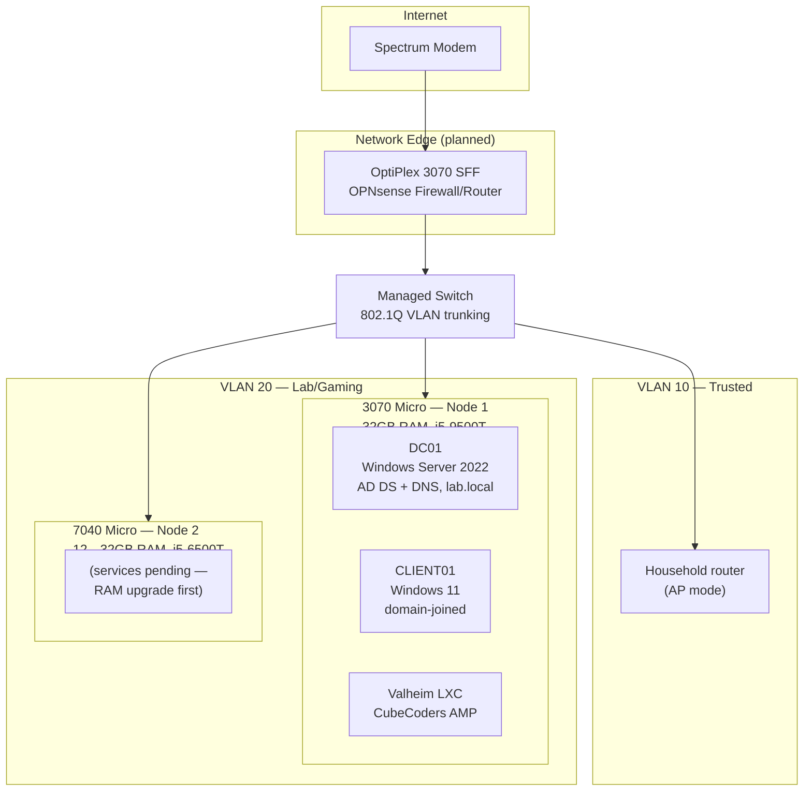

# Home Lab

A three-node virtualization and networking lab built from repurposed enterprise desktops, used to develop and demonstrate hands-on sysadmin, virtualization, and networking skills.

**Status:** active / in progress — see [Roadmap](#roadmap).

## Overview

- Started August 2026 on three Dell OptiPlex business desktops (SFF, Micro, Micro).
- Running today:
  - A 2-node Proxmox VE cluster
  - An Active Directory lab (Windows Server 2022 domain controller + domain-joined Windows 11 client)
  - A production-managed Valheim dedicated game server (CubeCoders AMP), serving real external players
- In progress: segmenting the lab onto its own VLAN behind an OPNsense firewall, moved off the flat household network.

## Architecture

**Current state note:** the diagram above is the target topology. The OPNsense/VLAN cutover hasn't happened yet — today everything still runs on the flat household network (`vmbr0`) while cabling and a second NIC for the edge box are sourced. The Proxmox cluster, AD lab, and Valheim server are all live now regardless of the network cutover status. Node 2 is cluster-joined but not yet hosting services — see Roadmap.

## Hardware

| Role | Hardware | RAM | CPU |
|---|---|---|---|
| Network edge (planned OPNsense) | OptiPlex 3070 SFF | — | i5-9500T (6C/6T) |
| Proxmox node 1 | OptiPlex 3070 Micro | 32GB | i5-9500T (6C/6T) |
| Proxmox node 2 | OptiPlex 7040 Micro | 12GB → 32GB (upgrade pending) | i5-6500T (4C/4T) |

## Services

| Service | Host | Purpose | Status |
|---|---|---|---|
| Proxmox VE cluster | 3070 Micro + 7040 Micro | Virtualization platform, 2-node, manual failover (no HA) | Live |
| DC01 — AD DS / DNS | 3070 Micro | Domain controller for `lab.local`, GPO/login testing | Live |
| CLIENT01 | 3070 Micro | Domain-joined Windows 11 client for AD testing | Live |
| Valheim (AMP) | 3070 Micro | Dedicated game server, modded, open to external players | Live |
| OPNsense firewall/router | 3070 SFF | Network edge, VLAN segmentation | Planned |

## Key Engineering Decisions

- **Skipped HA, kept quorum simple.** A 2-node cluster only has 2 corosync votes, so losing either node freezes cluster-wide management (though running VMs stay up locally). Chose to manage placement manually rather than add a QDevice tie-breaker, since it's a solo lab — documented the tradeoff rather than ignoring it.
- **Found the real bottleneck was CPU, not RAM.** The older node (7040 Micro) looked RAM-constrained at first, but benchmarking the CPUs (i5-6500T, 4C/4T, no hyperthreading vs. the newer nodes' 6C/6T) showed CPU headroom was the actual long-term limit. Re-planned workload placement around that instead of the RAM upgrade alone.
- **Built the game server as an LXC container, not a VM**, for lighter resource use — and rejected a low-trust, single-maintainer community install script (1-star repo) in favor of a manual, auditable SteamCMD + systemd build, after specifically checking script provenance before running anything as root.
- **Migrated to a managed platform (AMP) without losing the world state**, by copying the save files into AMP's instance directory and confirming in the logs that it loaded the existing world rather than silently generating a new one.

## Roadmap

- [ ] Complete OPNsense/VLAN network cutover (2 VLANs: trusted household, lab/gaming)
- [ ] RAM upgrade (7040 Micro, 12GB → 32GB) and SSD storage installs across all three nodes
- [ ] PowerShell AD automation — scripted user provisioning (CSV → AD user + group + OU, with error handling and logging)
- [ ] Backup restore validation — actually restore a VM from the existing nightly Proxmox backup job and document the process, not just confirm the job runs
- [ ] Lightweight SIEM (Wazuh) — centralize and monitor AD/service logs for authentication anomalies

## Runbooks

Real incidents hit during this build, diagnosed and fixed, written up as case studies: [docs/runbooks.md](docs/runbooks.md).
