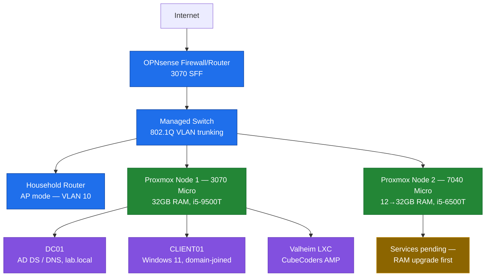

# Network Topology

This is the lab's target architecture. Flat (no nested boxes) so it renders cleanly, with color grouping instead of nested subgraphs: blue for edge/network infrastructure, green for the Proxmox platform and its guests, gold for what's still pending.

## Current state vs. target

This diagram is the **target** topology, not what's live today. Right now the lab still runs on the flat household network (`vmbr0`) — the OPNsense/VLAN cutover hasn't happened yet, pending a second NIC for the edge box and more network cabling. The Proxmox cluster, AD lab, and Valheim server are all live regardless; only the edge/segmentation layer is still pending. See [network-segmentation.md](../docs/network-segmentation.md) for the cutover plan.
